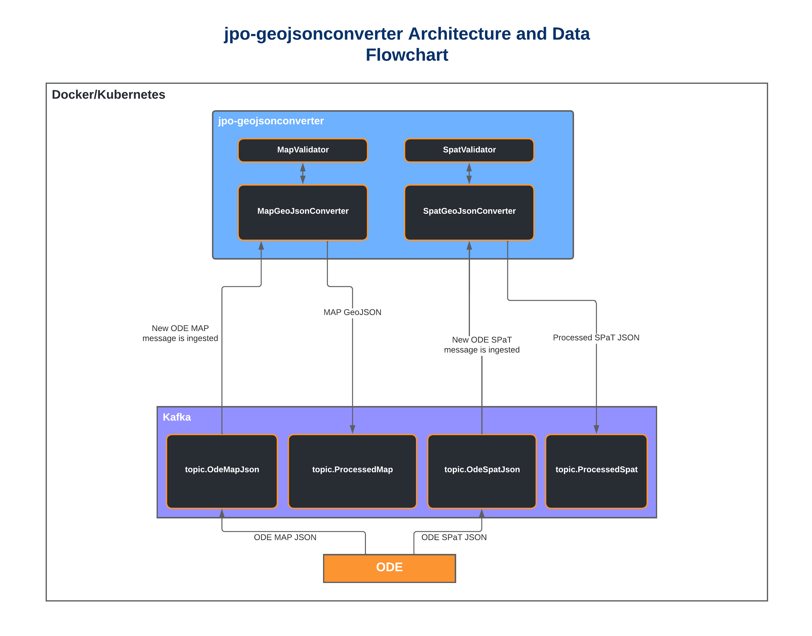

# jpo-geojsonconverter

**US Department of Transportation (USDOT) Intelligent Transportation Systems (ITS) Joint Program Office (JPO) Intersection GeoJSON Converter**

The JPO Intersection GeoJSON Converter is a real-time validator and data converter of JPO-ODE MAP and SPaT JSON based on the SAE J2735 message standard. Messages are consumed from Kafka and validated based on both the SAE J2735 standard and the more robust Connected Transportation Interoperability (CTI) Intersection Implementation Guide Message Requirements (Section 3.3.3). Message validation occurs simultaneously as the GeoJSON converter converts the JPO-ODE MAP and SPaT messages into mappable geoJSON. The JPO Intersection GeoJSON Converter outputs the resulting geoJSON onto Kafka topics. These messages contain validation information that identifies all issues encountered with validation, if any.



The message validation has been included in the jpo-geojsonconverter in order to prevent too many small microservices from being created. The extent of the current validation that occurs is surface level and is supported by simple verification against a schema that is based on J2735 and the CTI Intersection Implementation Guide. There may be reason to eventually break this feature out into a new, separate repository if more complex validation must be performed.

All stakeholders are invited to provide input to these documents. To provide feedback, we recommend that you create an "issue" in this repository (<https://github.com/usdot-jpo-ode/jpo-geojsonconverter/issues>). You will need a GitHub account to create an issue. If you don’t have an account, a dialog will be presented to you to create one at no cost.

## Release Notes
The current version and release history of the JPO GeoJSON Converter: [Release Notes](<docs/Release_notes.md>)

---

<a name="toc"/>

## Table of Contents

1.  [Usage Example](#usage-example)
2.  [Configuration](#configuration)
3.  [Installation](#installation)
4.  [File Manifest](#file-manifest)
5.  [Development Setup](#development-setup)
6.  [Contact Information](#contact-information)
7.  [Contributing](#contributing)
<!--
#########################################
############# Usage Example #############
#########################################
 -->

<a name="usage-example"/>

## 1. Usage Example

The jpo-geojsonconverter is used to convert the ODE JSON output of MAP, SPaT and BSM messages into GeoJSON ProcessedMap, enhanced ProcessedSpat, and GeoJSON ProcessedBsm messages. In order to verify your jpo-geojsonconverter is functioning, you must run the jpo-ode, then the jpo-geojsonconverter, and then send the jpo-ode raw ASN1 encoded MAP, SPaT and BSM data.

Follow the configuration section to properly configure and launch your jpo-ode and jpo-geojsonconverter.

Run one of the UDP sender Python scripts from the [jpo-ode repository](https://github.com/usdot-jpo-ode/jpo-ode/tree/dev/scripts/tests) to generate some example MAP/SPaT/BSM messages. Make sure to set your DOCKER_HOST_IP environment variable so the script will properly send the ASN1 encoded messages to your locally running JPO-ODE.

Once the message has been sent to the jpo-ode, it will be eventually be decoded and serialized into a JSON string. This string will be placed into the Kafka topics topic.OdeMapJson, topic.OdeSpatJson, and topic.OdeBsmJson. The jpo-geojsonconverter will then transform them into geoJSON. If a user needs WKT formatted GeoJSON, it is possible to turn this on by specifying the geometry.output.mode environment variable to "WKT". Currently WKT does not support the BSM messages.

### <b>Output Message Types</b>

### ProcessedMap
When an OdeMapJson message is processed through the jpo-geojsonconverter, a ProcessedMap message is created. This message is a single JSON object that contains two geoJSON FeatureCollection objects and one regular JSON object. 

- *mapFeatureCollection* - Feature Collection for storing all of the unique metadata and geographic data for each lane in an intersection. Mapping this object would display all defined lanes in an OdeMapJson object.
- *connectingLanesFeatureCollection* - Feature Collection for storing all geographic data for connecting lanes within an intersection. When mapped, the feature collection displays a bunch of two point lines connecting each egress lane to all possible and legal traversals to ingress lanes. Useful for visualizing ProcessedSpat data.
- *properties* - General metadata and property values that are important to keep with the processed MAP message but aren't related to any single lane in the intersection. RSU IP, intersection ID, and validation messages are stored here.

[ProcessedMap schema can be found here.](<jpo-geojsonconverter/src/main/resources/schemas/processed-map.schema.json>)

### ProcessedSpat
When an OdeSpatJson message is processed through the jpo-geojsonconverter, a ProcessedSpat message is created. This message is a single JSON object that contains all of the important information within a SPaT message for matching it to a corresponding ProcessedMap message and for identifying its state. There is no geoJSON component to a ProcessedMap message on its own.

[ProcessedSpat schema can be found here.](<jpo-geojsonconverter/src/main/resources/schemas/processed-spat.schema.json>)

Example ProcessedSpat message:

```
{
  "messageType": "SPAT",
  "odeReceivedAt": "2023-06-20T06:18:20.577365Z",
  "originIp": "10.0.0.2",
  "intersectionId": 12108,
  "cti4501Conformant": false,
  "validationMessages": [
    {
      "message": "$.metadata.receivedMessageDetails.locationData: is missing but it is required",
      "jsonPath": "$.metadata.receivedMessageDetails",
      "schemaPath": "#/$defs/OdeSpatMetadata/properties/receivedMessageDetails/required"
    }
  ],
  "revision": 0,
  "status": {
    "manualControlIsEnabled": false,
    "stopTimeIsActivated": false,
    "failureFlash": false,
    "preemptIsActive": false,
    "signalPriorityIsActive": false,
    "fixedTimeOperation": false,
    "trafficDependentOperation": false,
    "standbyOperation": false,
    "failureMode": false,
    "off": false,
    "recentMAPmessageUpdate": false,
    "recentChangeInMAPassignedLanesIDsUsed": false,
    "noValidMAPisAvailableAtThisTime": false,
    "noValidSPATisAvailableAtThisTime": false
  },
  "utcTimeStamp": "2023-06-20T06:18:17.679Z",
  "states": [
    {
      "signalGroup": 1,
      "stateTimeSpeed": [
        {
          "eventState": "STOP_AND_REMAIN",
          "timing": {
            "minEndTime": "2023-06-20T06:18:17.6Z",
            "maxEndTime": "2023-06-20T06:18:17.6Z"
          }
        }
      ]
    },
    {
      "signalGroup": 2,
      "stateTimeSpeed": [
        {
          "eventState": "PROTECTED_MOVEMENT_ALLOWED",
          "timing": {
            "minEndTime": "2023-06-20T06:18:21.6Z",
            "maxEndTime": "2023-06-20T06:18:37.6Z"
          }
        }
      ]
    }
  ]
}
```

### ProcessedBsm
When an OdeBsmJson message is processed through the jpo-geojsonconverter, a ProcessedBsm message is created. This message is a GeoJSON feature collection that contains extra metadata fields that represents a single BSM.

- *type* - The type of object the JSON is. This will always be a 'FeatureCollection'.
- *features* - Feature Collection for storing all of the unique BSM payload and geographic data for each lane in an intersection. Mapping this object would display a single point representing the BSM.
- *schemaVersion* - The schema version that the JSON object was generated for.
- *messageType* - The message type the FeatureCollection represents.
- *odeReceivedAt* - A date-time string representing when the BSM was received by the ODE.
- *timestamp* - A date-time string representing when the BSM processed and transformed into a ProcessedBsm.
- *originIp* - An IP string representing the RSU the BSM was generated by if there is a IP present.
- *validationMessages* - A list of validation messages that specify issues found within the original OdeBsmJson object based on the JSON schema.

```
{
    "type": "FeatureCollection",
    "features": [
        {
            "type": "Feature",
            "geometry": {
                "type": "Point",
                "coordinates": [
                    -105.0342901,
                    40.5671913
                ]
            },
            "properties": {
                "accelSet": {
                    "accelLat": 2001,
                    "accelLong": 0,
                    "accelVert": -127,
                    "accelYaw": 0
                },
                "accuracy": {
                    "semiMajor": 5,
                    "semiMinor": 2,
                    "orientation": 0
                },
                "brakes": {
                    "wheelBrakes": {
                        "leftFront": false,
                        "rightFront": false,
                        "unavailable": true,
                        "leftRear": false,
                        "rightRear": false
                    },
                    "traction": "unavailable",
                    "abs": "unavailable",
                    "scs": "unavailable",
                    "brakeBoost": "unavailable",
                    "auxBrakes": "unavailable"
                },
                "heading": 359.4,
                "id": "12A7A951",
                "msgCnt": 25,
                "secMark": 2800,
                "size": {
                    "width": 208,
                    "length": 586
                },
                "transmission": "UNAVAILABLE"
            }
        }
    ],
    "schemaVersion": 1,
    "messageType": "BSM",
    "odeReceivedAt": "2024-08-12T12:32:03.811Z",
    "originIp": "172.19.0.1",
    "validationMessages": [],
    "timeStamp": "2024-08-12T12:32:04.3034091Z"
}
```

[Back to top](#toc)

<!--
#########################################
############# Configuration #############
#########################################
 -->

<a name="configuration"/>

## 2. Configuration

### System Requirements

Recommended machine specs running Docker to run the GeoJsonConverter:
-  Minimum RAM: 16 GB
-  Minimum storage space: 100 GB
-  Supported operating systems:
   -  Ubuntu 20.04 Linux (Recommended)
   -  Windows 10/11 Professional (Professional version required for Docker virtualization)
   -  OSX 10 Mojave

The GeoJsonConverter software can run on most standard Window, Mac, or Linux based computers with
Pentium core processors. Performance of the software will be based on the computing power and available RAM in
the system.  Larger data flows can require much larger space requirements depending on the
amount of data being processed by the software. The GeoJsonConverter software application was developed using the open source programming language Java. If running the GeoJsonConverter outside of Docker, the application requires the Java 21 runtime environment.

### Software Prerequisites

The GeoJsonConverter is a micro service that runs as an independent application but serves the sole purpose of converting JSON objects created by the JPO-ODE via Apache Kafka. To support these JSON objects, the GeoJsonConverter application utilizes some classes from the JPO-ODE repository. This is included into the GeoJsonConverter as a submodule but the JPO-ODE should also be run independently of the jpo-geojsonconverter. The JPO-ODE is still required to launch Kafka, Zookeeper, the ASN1 decoder and create the required Kafka topics. All other required dependencies will automatically be downloaded and installed as part of the Docker build process.

- Docker: <https://docs.docker.com/engine/installation/>
- Docker-Compose: <https://docs.docker.com/compose/install/>

### Tips and Advice

Read the following guides to familiarize yourself with GeoJsonConverter's Docker and the ODE managed Kafka modules.

- [Docker README](docker.md)
- [ODE Kafka README](https://github.com/usdot-jpo-ode/jpo-ode/blob/dev/kafka.md)

**Installation and Deployment:**

- Docker builds may fail if you are on a corporate network due to DNS resolution errors.
- Windows users may find more information on installing and using Docker [here](https://github.com/usdot-jpo-ode/jpo-ode/wiki/Docker-management).
- Users interested in Kafka may find more guidance and configuration options [here](docker/kafka/README.md).

**Configuration:**

The GeoJsonConverter configuration is customized through the environment variables provided to Docker when Docker-Compose runs the Docker built GeoJsonConverter image. You may customize the Kafka broker endpoint.

**Important!**
You must rename `sample.env` to `.env` in both the [root directory](sample.env) and in [jpo-utils](jpo-utils/sample.env) for Docker to automatically read the file. Do not push this file to source control. 

[Back to top](#toc)

<!--
########################################
############# Installation #############
########################################
 -->

<a name="installation"/>

## 3. Installation

The following instructions describe the minimal procedure to fetch, build, and run the main GeoJsonConverter application.

#### Step 0 - For Windows Users Only

If running on Windows, please make sure that your global git config is set up to not convert end-of-line characters during checkout.

Disable `git core.autocrlf` (One Time Only)

```bash
git config --global core.autocrlf false
```

#### Step 1 - Download the Source Code

Note: to avoid cloning redundant local copies of submodules, if you intend to run the entire ConflictVisualizer system, you should instead start with [step 1 of the ConflictVisualizer Installation Guide](https://github.com/usdot-jpo-ode/jpo-conflictvisualizer?tab=readme-ov-file#1-initialize-and-update-submodules) before returning to step 2 below.

The jpo-geojsonconverter software system consists of the following modules hosted in separate Github repositories:

|Name|Visibility|Description|
|----|----------|-----------|
|[jpo-geojsonconverter](https://github.com/usdot-jpo-ode/jpo-geojsonconverter)|public|Contains the public components of the application code.|
|[jpo-ode](https://github.com/usdot-jpo-ode/jpo-ode)|public|Contains the public classes and libraries of the jpo-ode used in the GeoJsonConverter.|

You may download the stable, default branch for ALL of these dependencies by using the following recursive git clone command:

```bash
git clone https://github.com/usdot-jpo-ode/jpo-geojsonconverter.git
```

Once you have these repositories obtained, you are ready to build and deploy the application.

#### Step 2 - Build and run jpo-ode application

Navigate to the root directory of the jpo-ode project and run the following command:

```bash
docker-compose up --build -d
docker-compose ps
```

Verify the jpo-ode, kafka, zookeeper, asn1-decoder and asn1-encoder are running before performing step 3.

#### Step 3 - Generate GitHub Token

A GitHub token is required to pull artifacts from GitHub repositories. This is required to obtain the jpo-ode jars and must be done before attempting to build this repository.

1. Log into GitHub.
2. Navigate to Settings -> Developer settings -> Personal access tokens.
3. Click "New personal access token (classic)".
   1. As of now, GitHub does not support `Fine-grained tokens` for obtaining packages.
4. Provide a name and expiration for the token.
5. Select the `read:packages` scope.
6. Click "Generate token" and copy the token.
7. Copy the token name and token value into your `.env` file.
8. Create a copy of [settings.xml](jpo-geojsonconverter/settings.xml) and save it to `~/.m2/settings.xml`
9. Update the variables in your `~/.m2/settings.xml` with the token name, token value, and target jpo-ode organization

#### Step 4 - Build and run jpo-geojsonconverter application

**Notes:**
- Docker builds may fail if you are on a corporate network due to DNS resolution errors.
- In order for Docker to automatically read the environment variable file, you must rename it from `sample.env` to `.env`. **This file will contain private keys, do not put add it to version control.**. A copy of the `sample.env` file must be created in [jpo-utils](jpo-utils/sample.env) in order for the base applications (kafka, mongo, etc.) to start up correctly
- Unless you intend to run geojsonconverter without jpo-ode, replace the contents of docker-compose.yml with those of docker-compose-standalone.yml.

Navigate to the root directory of the jpo-geojsonconverter project and run the following command:

```bash
docker-compose up --build -d
docker-compose ps
```

To bring down the services and remove the running containers run the following command:

```bash
docker-compose down
```
For a fresh restart, run:

```bash
docker-compose down
docker-compose up --build -d
docker-compose ps
```

To completely rebuild from scratch, run:

```bash
docker-compose down
docker-compose rm -fvs
docker-compose up --build -d
docker-compose ps
```

## Environment variables

### Purpose & Usage

- The `DOCKER_HOST_IP` environment variable is used to communicate with the bootstrap server that the instance of Kafka is running on.
- The `MAVEN_GITHUB_TOKEN_NAME` environment variable is the name of the generated token from xxx used for pulling the jpo-ode java image.
- The `MAVEN_GITHUB_TOKEN` environment variable is the value of the generated token from xxx used for pulling the jpo-ode java image.
- The `MAVEN_GITHUB_ORG` environment variable is the name of the GitHub organization to use for the jpo-ode repository.

### Values
In order to utilize Confluent Cloud:

- DOCKER_HOST_IP must be set to the bootstrap server address (excluding the port)

[Back to top](#toc)
	
<!--
#########################################
############# File Manifest #############
#########################################
 -->

<a name="file-manifest"/>

## 4. File Manifest

This section outlines the software technology stacks of the GeoJsonConverter.

### Containerization and Management

- [Docker](https://www.docker.com/)
- [Docker-Compose](https://docs.docker.com/compose/)

### Messaging

- [Kafka](https://kafka.apache.org/)

### ODE Code

- [Java](https://openjdk.java.net/)
- [Maven](https://maven.apache.org/)
- [Spring Boot](http://spring.io/projects/spring-boot)
- [Logback](https://logback.qos.ch/)
- [SNMP4J](https://www.snmp4j.org/)
- [JUnit](https://junit.org)
- [JMockit](http://jmockit.github.io/)

[Back to top](#toc)

<!--
#############################################
############# Development Setup #############
#############################################
 -->

<a name="development-setup"/>

## 5. Development Setup

### Integrated Development Environment (IDE)

Install the IDE of your choice:

* Eclipse: [https://eclipse.org/](https://eclipse.org/)
* STS: [https://spring.io/tools/sts/all](https://spring.io/tools/sts/all)
* IntelliJ: [https://www.jetbrains.com/idea/](https://www.jetbrains.com/idea/)

### Continuous Integration

* TravisCI: <https://travis-ci.org/usdot-jpo-ode/jpo-ode>

[Back to top](#toc)

<!--
###############################################
############# Contact Information #############
###############################################
 -->

<a name="contact-information"/>

## 6. Contact Information

Contact the developers of the GeoJsonConverter application by submitting a [Github issue](https://github.com/usdot-jpo-ode/jpo-geojsonconverter/issues).

### License information

Licensed under the Apache License, Version 2.0 (the "License"); you may not use this
file except in compliance with the License.
You may obtain a copy of the License at <http://www.apache.org/licenses/LICENSE-2.0>
Unless required by applicable law or agreed to in writing, software distributed under
the License is distributed on an "AS IS" BASIS, WITHOUT WARRANTIES OR CONDITIONS OF ANY KIND, either expressed or implied. See the License for the specific language governing
permissions and limitations under the [License](http://www.apache.org/licenses/LICENSE-2.0).

[Back to top](#toc)

<!--
########################################
############# Contributing #############
########################################
 -->

<a name="contributing"/>

## 7. Contributing

Please read our [contributing guide](docs/contributing_guide.md) to learn about our development process, how to propose pull requests and improvements, and how to build and test your changes to this project.

### Source Repositories - GitHub

- Main repository on GitHub (public)
	- <https://github.com/usdot-jpo-ode/jpo-geojsonconverter>
- USDOT ITS JPO ODE on Github (public)
	- <https://github.com/usdot-jpo-ode/jpo-ode>

[Back to top](#toc)